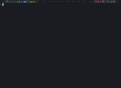

# What

A simple way to enter in your projects folders from anywhere


Instalation
------------
### Requirements
- [fzf](https://github.com/junegunn/fzf)

### MacOs or Linux
```sh
curl -sSL https://raw.githubusercontent.com/albertalef/projectme/master/install.sh | sh
```

### Windows
> [!WARNING]
> Comming...
